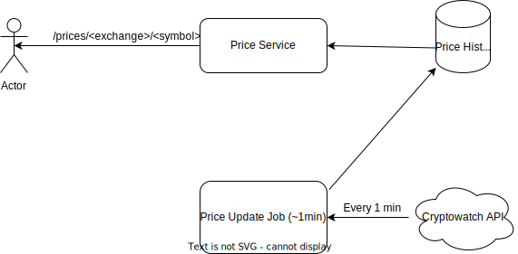

# DATA TRACKER
This applicatiion utilizes [Cryptowatch API](https://docs.cryptowat.ch/rest-api/) to fetch currency pair prices on 1 minute intervals. The price historical data is then stored, and used to retrive the history of price changes in the last 24 hours along with the standard deviation for the same period of time. Crypowatch supports 23 markets, so to simplify the project supported markets have to be configured int the `.env` file
The app runs on port 80, and the endpoint to view the currency pair's 24-hr history is `GET http://localhost:80/prices/<exchange>/<symbol>`

Sample request & response
```
GET http://localhost:80/prices/binance-us/1inchusd

{
    "prices": [
        {
            "exchange": "binance-us",
            "id": 7062,
            "price": 0.632,
            "symbol": "1inchusd",
            "updated_at": "Mon, 07 Nov 2022 23:05:08 GMT"
        },
        {
            "exchange": "binance-us",
            "id": 6755,
            "price": 0.632,
            "symbol": "1inchusd",
            "updated_at": "Mon, 07 Nov 2022 23:04:08 GMT"
        },
        {
            "exchange": "binance-us",
            "id": 6448,
            "price": 0.632,
            "symbol": "1inchusd",
            "updated_at": "Mon, 07 Nov 2022 23:02:25 GMT"
        },
        {
            "exchange": "binance-us",
            "id": 6141,
            "price": 0.631,
            "symbol": "1inchusd",
            "updated_at": "Mon, 07 Nov 2022 22:56:16 GMT"
        },
        {
            "exchange": "binance-us",
            "id": 5834,
            "price": 0.631,
            "symbol": "1inchusd",
            "updated_at": "Mon, 07 Nov 2022 22:55:16 GMT"
        },
        {
            "exchange": "binance-us",
            "id": 5527,
            "price": 0.631,
            "symbol": "1inchusd",
            "updated_at": "Mon, 07 Nov 2022 22:54:16 GMT"
        },
        {
            "exchange": "binance-us",
            "id": 5220,
            "price": 0.631,
            "symbol": "1inchusd",
            "updated_at": "Mon, 07 Nov 2022 22:50:19 GMT"
        },
        {
            "exchange": "binance-us",
            "id": 4913,
            "price": 0.631,
            "symbol": "1inchusd",
            "updated_at": "Mon, 07 Nov 2022 22:49:18 GMT"
        },
        {
            "exchange": "binance-us",
            "id": 4606,
            "price": 0.631,
            "symbol": "1inchusd",
            "updated_at": "Mon, 07 Nov 2022 22:48:19 GMT"
        },
        {
            "exchange": "binance-us",
            "id": 4299,
            "price": 0.631,
            "symbol": "1inchusd",
            "updated_at": "Mon, 07 Nov 2022 22:47:19 GMT"
        },
        {
            "exchange": "binance-us",
            "id": 3992,
            "price": 0.631,
            "symbol": "1inchusd",
            "updated_at": "Mon, 07 Nov 2022 22:46:19 GMT"
        },
        {
            "exchange": "binance-us",
            "id": 3685,
            "price": 0.631,
            "symbol": "1inchusd",
            "updated_at": "Mon, 07 Nov 2022 22:43:33 GMT"
        },
        {
            "exchange": "binance-us",
            "id": 3378,
            "price": 0.631,
            "symbol": "1inchusd",
            "updated_at": "Mon, 07 Nov 2022 22:42:34 GMT"
        },
        {
            "exchange": "binance-us",
            "id": 3071,
            "price": 0.631,
            "symbol": "1inchusd",
            "updated_at": "Mon, 07 Nov 2022 22:41:34 GMT"
        },
        {
            "exchange": "binance-us",
            "id": 2764,
            "price": 0.631,
            "symbol": "1inchusd",
            "updated_at": "Mon, 07 Nov 2022 22:40:34 GMT"
        },
        {
            "exchange": "binance-us",
            "id": 2457,
            "price": 0.631,
            "symbol": "1inchusd",
            "updated_at": "Mon, 07 Nov 2022 22:39:33 GMT"
        },
        {
            "exchange": "binance-us",
            "id": 2150,
            "price": 0.631,
            "symbol": "1inchusd",
            "updated_at": "Mon, 07 Nov 2022 22:38:33 GMT"
        },
        {
            "exchange": "binance-us",
            "id": 1843,
            "price": 0.631,
            "symbol": "1inchusd",
            "updated_at": "Mon, 07 Nov 2022 22:37:33 GMT"
        },
        {
            "exchange": "binance-us",
            "id": 1536,
            "price": 0.631,
            "symbol": "1inchusd",
            "updated_at": "Mon, 07 Nov 2022 22:36:33 GMT"
        },
        {
            "exchange": "binance-us",
            "id": 1229,
            "price": 0.631,
            "symbol": "1inchusd",
            "updated_at": "Mon, 07 Nov 2022 22:35:33 GMT"
        },
        {
            "exchange": "binance-us",
            "id": 922,
            "price": 0.631,
            "symbol": "1inchusd",
            "updated_at": "Mon, 07 Nov 2022 22:34:33 GMT"
        },
        {
            "exchange": "binance-us",
            "id": 615,
            "price": 0.631,
            "symbol": "1inchusd",
            "updated_at": "Mon, 07 Nov 2022 22:33:33 GMT"
        },
        {
            "exchange": "binance-us",
            "id": 308,
            "price": 0.631,
            "symbol": "1inchusd",
            "updated_at": "Mon, 07 Nov 2022 22:32:33 GMT"
        },
        {
            "exchange": "binance-us",
            "id": 1,
            "price": 0.63,
            "symbol": "1inchusd",
            "updated_at": "Mon, 07 Nov 2022 22:31:33 GMT"
        }
    ],
    "stdv": 0.0004082482904638634
}

```

## Running the app locally
- Install docker, the [desktop application] (https://www.docker.com/products/docker-desktop/) will install docker and provide a GUI to manage your containers
- Get an API key from https://cryptowat.ch/account/api-access
- Copy `.env.example` to `.env`
- Fill in the `API_KEY` value with the key retrieve previsouly
- Specify a comma-separated list of currency markets of interests in the `SUPPORTED_EXCHANGES` variable. The entire list of possible values can be found here: https://docs.cryptowat.ch/rest-api/#supported-exchanges

- Run the database service locally with `docker compose up -d db`
- Build and run the application locally with `docker compose up --build datatracker`
- A job to update currency prices will start running every minute
- After a couple of minute you can query the data for a given exchange market nd symbol
via 
`GET http://localhost:80/prices/<exchange>/<symbol>` endpoint

## Execute unit tests

## Execute integration tests

## Technical Details
- A background job that is scheduled for every minute pulls data from https://api.cryptowat.ch/markets/prices and only stores the info associated with  configured currency markets in `SUPPORTED_EXCHANGES`. This process uses the cursor to go through all the results
- `GET http://localhost:80/prices/<exchange>/<symbol>` endpoint exposes the historical currency price for the last 24 hours in a chronological order. It also surfaces the standard deviation of the price.

 

# Missing requirements
- Ranking currency pairs

## Major issues
-  `update_price_history` function fetches for latest price updates and inserts them into the DB one by one. There are 23 markets (exchanges) without thousands of currency pairs which makes this design impracticable in production. Given that the job runs every minute, it's guaranteed that the second, third, etc instance will be kicked off before the first one completes

- `price_history` database table is going to grow exponentially, and making the insertions even slower due to re-indexing and chekcing for constraints. API will definitely be lagging while filtering and ordering by date

## Proposed Enhacements
- Price updates: instead of pulling and inserting in the same function, we can separate the pull into its own process (Lambda) which then broadcast each update into a message topic to be picked up and processed by an instance of a separate process. Lambda would be a good candidate as they can scale up depending on the input.
- Data store: Now that the update service is scaled up the relational DB will be a bottleneck. It makes sense to use store that can scale horizontally on-demand such as Dynamo DB
- API performance: We can cache the most recent data into in-memory store like Redis to minimize latency when a user attempts to view the last 24-hr info

 


# Dependencies
- flask: Python framework
- psycopg2-binary: To Create Postgres Database connection
- Flask-SQLAlchemy: Generate SQL queries automatically
- Flask-APScheduler: Schedule a job
- python-dotenv: To read and process environment variables file

# References
- Sample project for Python/Flask: https://www.tinystacks.com/blog-post/flask-crud-api-with-postgres/
- Flask/SQL Alchemy: https://flask-sqlalchemy.palletsprojects.com/en/2.x/api/
- API Documentation: https://docs.cryptowat.ch/rest-api/
- Scheduling a function with Flask: https://www.techcoil.com/blog/how-to-create-an-interval-task-that-runs-periodically-within-your-python-3-flask-application-with-flask-apscheduler/